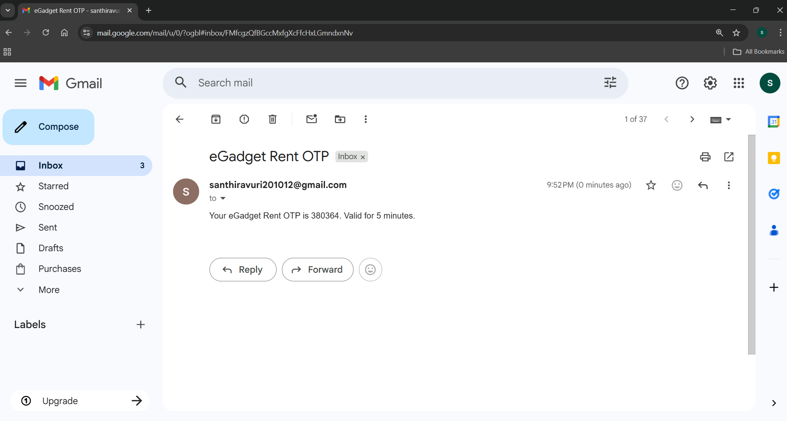
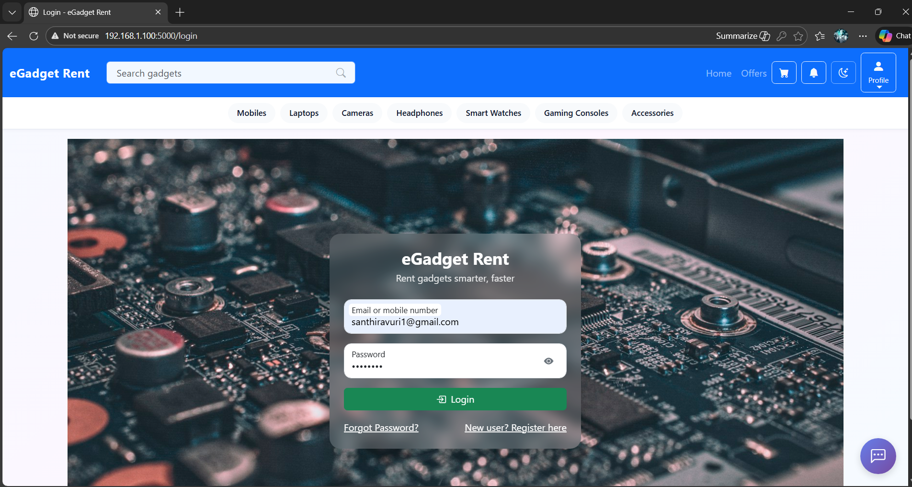
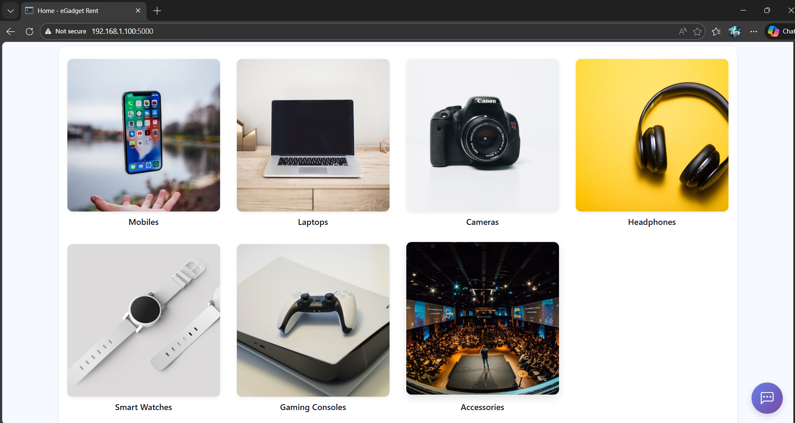
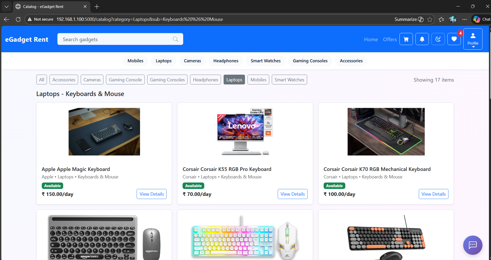
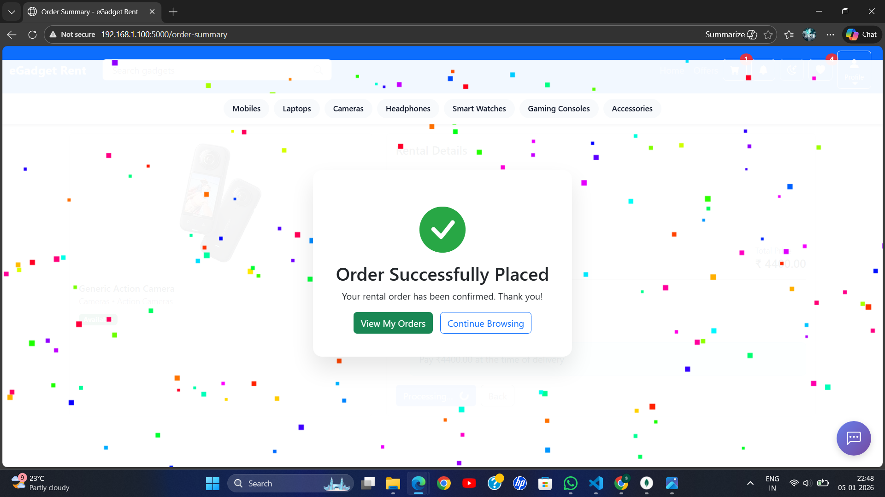
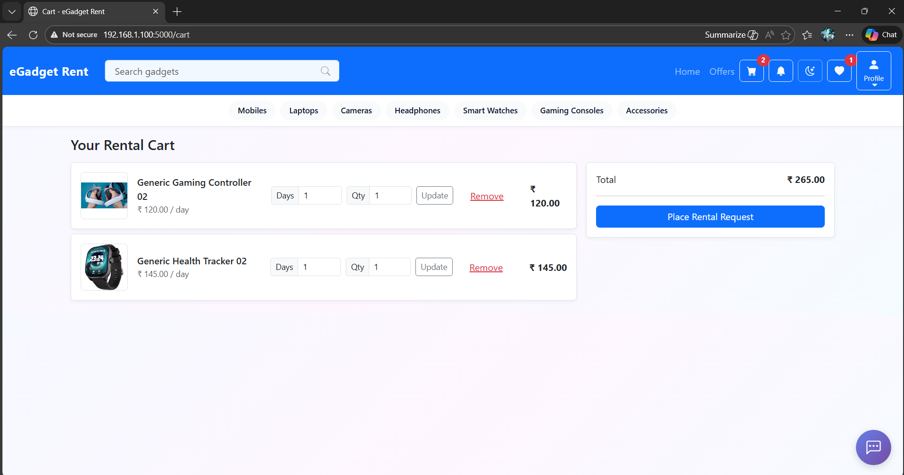
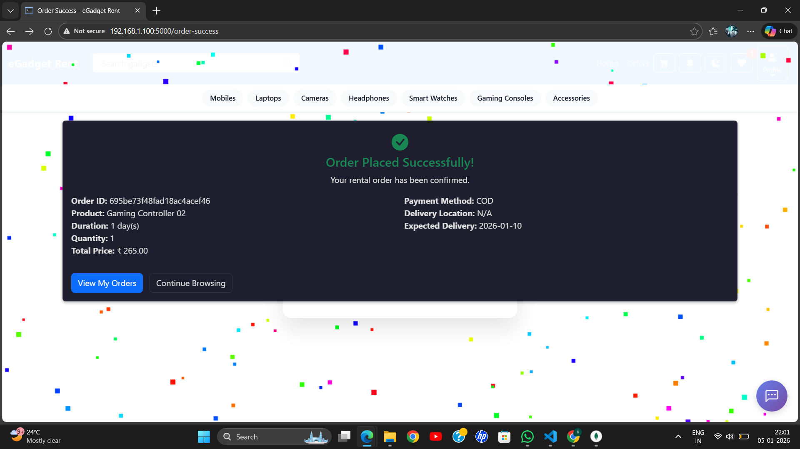
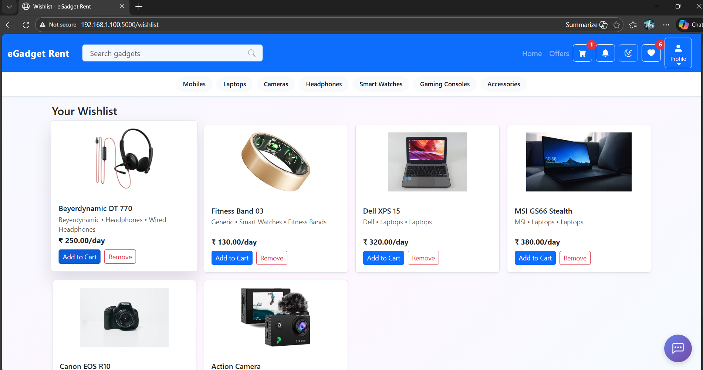
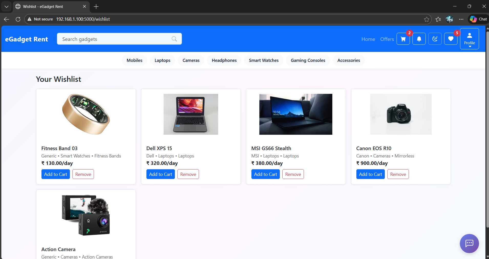
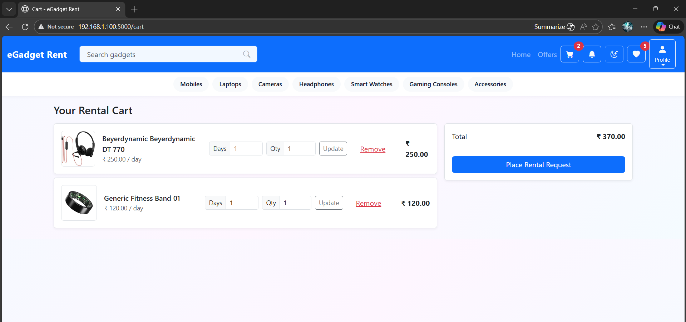

🛒 EGadget Rental Platform
📌 Project Overview

EGadget Rental Platform is a full-stack web application that allows users to rent electronic gadgets such as laptops, smartphones, tablets, monitors, and accessories for a selected number of days.
The platform supports secure user registration with OTP verification, category-based product navigation, cart & wishlist, order placement, and admin management.

🎯 Project Objectives

Provide an online platform for renting electronic gadgets

Implement secure user authentication with OTP verification

Organize products using categories and subcategories

Enable smooth order placement with rental duration and payment options

Provide admin control over products and orders

Follow clean and scalable project structure

🛠️ Technology Stack
Backend

Python

Flask

MongoDB

PyMongo

Werkzeug (Password Hashing)

Frontend

HTML

CSS

JavaScript

Jinja2 Templates

Tools

Git & GitHub

dotenv

pytest

🗂️ Project Structure
EGADGET-RENTAL-PLATFORM/
│
├── app.py
├── README.md
├── IMPLEMENTATION_SUMMARY.md
├── requirements.txt
├── .gitignore
│
├── models/
├── services/
├── utils/
│
├── templates/
├── static/
│
├── tests/
├── scripts/
├── db_check/

👤 USER MODULE
📝 User Registration (OTP Verification)

Registration page available only for users

❌ No admin registration page

OTP is generated and sent to the user’s email ID

Registration completes only after OTP verification

🔐 User Login

Secure login using email and password

Passwords are securely hashed

🧭 Navigation Bar (Categories & Subcategories)

Dropdown menu for each main category

Subcategories displayed under each category

Selecting a subcategory loads related products

📦 Product Browsing
🗂️ Product Listing Page

Products displayed based on selected category/subcategory

Shows product image, name, and rental price

📄 Product Details Page

Displays detailed product information

User selects:

Quantity

Number of rental days

Delivery location

Payment method

🛒 Cart & Order Flow
🛍️ Cart Page

Displays selected products

Allows quantity update and removal

🧾 Place Order & Instructions

User reviews order details

Instruction page shown before final order placement

📋 Order Confirmation Page

Displays product details, rental duration, location, and payment method

✅ Successfully Placed Order

Displays confirmation message after successful order placement

❤️ Wishlist Page

Users can add products to wishlist

Wishlist items can be moved to cart

📦 My Orders Page

Displays all orders placed by the user

Shows order status and details

🎁 Offers Page

 

Displays available offers and discounts

👤 My Account (User)

User profile details

Account-related information

🔐 ADMIN MODULE
🔑 Admin Login

Only login available for admin

No admin registration page

🔽 Admin Profile Dropdown Menu

Orders

Products

My Account

Logout

📦 Admin – Product Management

Add new products

Update existing products

Manage categories and subcategories

📋 Admin – Orders Management

View all user orders

Monitor order details

👤 Admin – My Account

Admin profile details

🔐 Security Features

OTP-based email verification

Secure password hashing

Role-based access (User / Admin)

Environment variables stored securely in .env

🤝 Project Background & Contribution

This project was initially developed as a group project during a Hackathon.
Due to time constraints, the project was not completed during the hackathon event.

After the hackathon, the project was independently enhanced and completed based on personal interest and learning objectives.
Additional features, improvements, and refinements were implemented to make the application fully functional, structured, and production-ready.

🔧 Post-Hackathon Enhancements

Completed user and admin workflows

Implemented OTP-based user registration

Added category and subcategory navigation

Built cart, wishlist, and order placement features

Improved project structure and code organization

Added proper documentation and screenshots

👥 Team & Credits

This project acknowledges its hackathon origins while highlighting individual contributions made after the event.

Initial Hackathon Team: Group collaboration

Post-Hackathon Development: Individual effort driven by personal interest

🎯 Transparency Statement

This repository reflects the final, completed version of the project, built after the hackathon to demonstrate:

Practical software development skills

Real-world application workflows

Clean architecture and documentation

🚀 Conclusion

The EGadget Rental Platform demonstrates a complete real-world rental system with:

Secure authentication

Category-based navigation

Cart, wishlist, and order workflow

Admin product & order management

Clean and scalable project structure

This project is suitable for final-year evaluation, portfolio showcase, and real-world deployment concepts.
